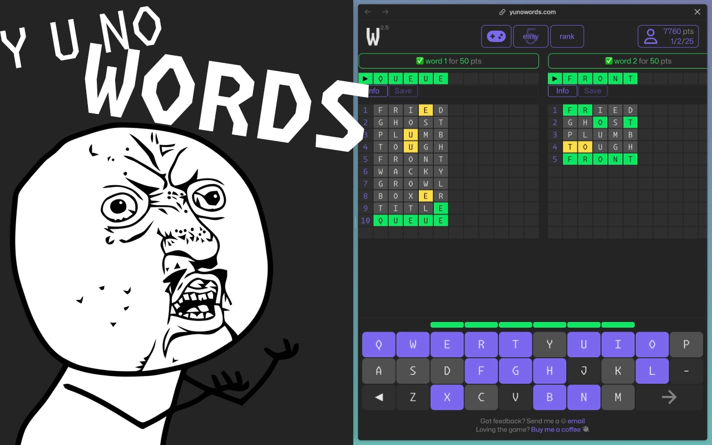

# Master 5000 essential English words the fun way!

Learn English with fun word puzzles and compete with players from around the world!

Play through [preview](game-play.mp4), or play the game at [yunowords.com](https://yunowords.com/).

## 🏁 Features

1. word puzzle fun, like wordle, if it were 6x!
2. word list: 5000 essential English words (UK)
3. easy, medium & hard mode for players of all English levels
4. built-in dictionary to look up unfamiliar words
5. register to represent your country & compete with players worldwide
6. SOON: save unfamiliar or words you like
7. SOON: create quizzes from your saved word list to revise

## 🖥️ Tech

1. react `18.2`
2. @tanstack/react-query `5.54`
3. @supabase/supabase-js `2.45`

## 🚀 Future

1. UI refresh
2. lots of animations!
3. wayyy better dictionary
4. players can save words
5. players can create quizzes from their saved words

## 📝 Notes

Coming soon...
